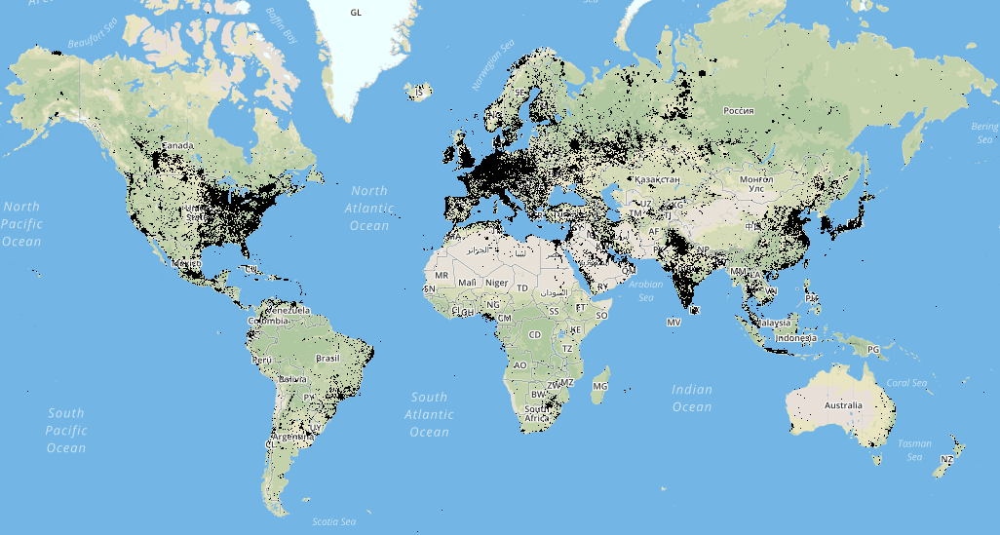

```{r setup, include = FALSE}
library(knitr)
opts_chunk$set(root.dir = '/home/anderson/ANLY502_Spring2020_Project/')
library(htmltools)

```

## Motivation

* How can we use big data to better understand developing countries?
* Can we figure out how to determine true economic data when official statistics are wrong or unavailable?
* Use satellites to track changes in GDP and other measures social development

<!--look to the night sky-->

## Dataset

* Yearly Satellite data from NOAA 1993-2013
* Used GeoPySpark to load and process the data
* Polygonal mean of shape files for each country
* We found out how annoying map projections can be in spark

```{r, echo = FALSE}


```

## EDA - light data processed

<iframe src="light.html"></iframe>

## EDA - light data indexed to 1993

<iframe src="light_index.html"></iframe>

## Next Steps
* Random forest regression RMSE = $5,838
* Linear regression RMSE = $14,312
* Try new model paramters and do more visualizations
* Takeaways so far: using big data, Spark, Spark packages, geodata