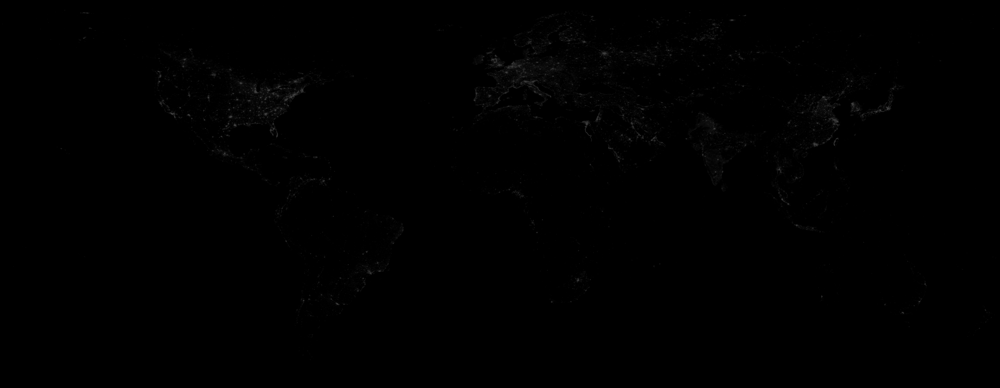

```{r setup, include = FALSE}
library(knitr)
opts_chunk$set(root.dir = '/home/anderson/ANLY502_Spring2020_Project/')
library(htmltools)
library(graphics)
```

## Motivation

* How can we use big data to better understand developing countries?
* How to determine true economic data when official statistics are wrong or unavailable?
* Goal: Use satellites to track changes in light along with other traditional economic variables to predict GDP per capita
* Audience: international investors, international development NGOs

<!--look to the night sky-->

## Data Prep

* Yearly satellite data from NOAA 1993-2013
* Other economic data sourced from World Bank, IMF, OECD
* Used GeoPySpark to load and process the satellite data
* Polygonal mean of shapes for each country using pycountry

```{r, echo = FALSE, out.width='80%'}
#
include_graphics('map_screenshot.png')
```

## EDA - light data processed

<iframe src="light.html"></iframe>

## EDA - light data indexed to 1993

<iframe src="light_index.html"></iframe>

## Preliminary Results

<iframe src="light_gdp.html" style="height:400px;width:650px;"></iframe>

* Linear regression (mean light only) RMSE = $17,312
* Linear regression RMSE = $13,691
* Random forest regression RMSE = $5,683

## Summary
Next steps:

* Try other model types, model parameters, and do more visualizations
* Try subsets of developing countries to see if explanatory power increases

Challenges:

* We found out how difficult map projections can be in spark
* Island nations had very high light values, using index helped

<!-- using big data, Spark, Spark packages, geodata -->